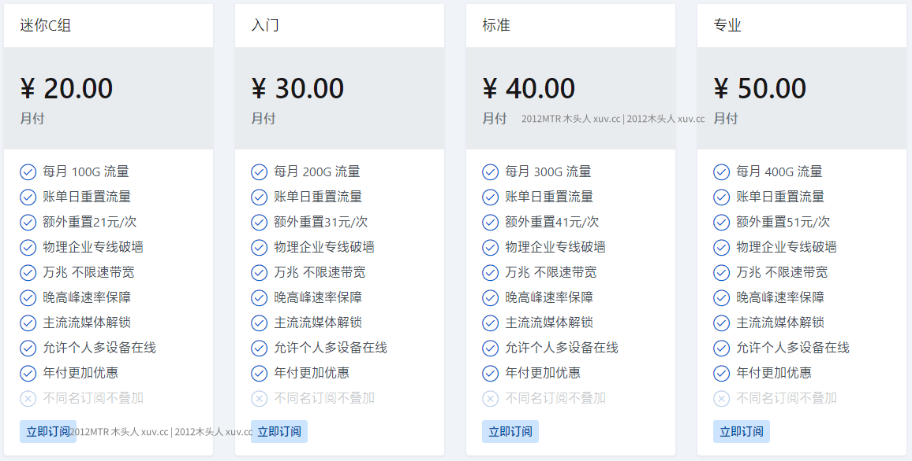

# Wallless机场最新官网地址入口

Wallless机场最新地址：[Walless机场注册]{https://www.wlsite8.com/#/register?code=sxRYeSFi)

## 简介

WallLess，原无界VPN（与轮子撞车而改名），又称WallLess加速器，是一家持续运营超过3年的中高端SS/V2Ray机场，拥有丰富的机场线路优化经验和技术实力。WallLess已经由隧道中转线路全部升级成企业级IPLC/IEPL专线，不过GFW，不会被封锁，网络延迟低，可用做游戏加速器，性价比超高。WallLess所有套餐节点全部使用企业级专线，无套路附加收费，还有流量包套餐和无限流量套餐（支持企业定制服务）。

## Wallless机场优惠码

🔥Wallless农-历-新-年-优-惠/域-名-更-换-公-告

⭐️Wallless祝您新的一年万事如意~
⭐️2024我们升级了新架构，稳定容灾、延迟更低

⭐️9折优惠码： wlyuming.com    ->  也是防失联发布页
⭐️8折优惠码(年付可用):   www.wlsite8.com    ->  也是新域名
⭐️新购、续费均可使用每人限用一次

⚠️请注意: 
⚠️存在未使用完成的订阅时，请点“续费”按钮，否则会造成不可逆覆盖
⚠️如您不想接收邮件可工单申请注销账号
⚠️购买后当天无法使用可申请退款

## Wallless 优势

<ul>
<li>在全球拥有超过20个优质线路节点，全部采用IPLC/IEPL内网专线；</li>
<li>拥有香港、台湾、日本、美国、新加坡、俄罗斯、印度等地区节点；</li>
<li>最高10Gbps的超大网络带宽，绝对能满足大部分用户的应用场景需求；</li>
<li>支持各种客户端软件使用订阅更新线路节点，还拥有自研的傻瓜式一键登录客户端；</li>
<li>支持Windows/Mac/iOS/Android/路由器，支持多设备同时使用；</li>
<li>支持NETFLIX/TVB/ABEMATV/Hulu等国外流媒体解锁；</li>
<li>新注册用户可免费试用1小时，不限制速度和流量；</li>
<li>套餐配置较为灵活，基本能满足很多应用场景需求；</li>
<li>无设备数量限制，理论上可无限多人同时使用；</li>
<li>支持支付宝、微信和虚拟货币付款，方便快捷；</li>
<li>客户服务支持网页在线客服、提交工单和实时聊天沟通。</li>
</ul>

## Wallless 套餐介绍

Wallless机场最新地址：[wlsite8.com](https://www.wlsite8.com/#/register?code=sxRYeSFi)

## 注意事项

虽然WallLess看着价格稍贵，但其实很便宜，因为它从来就没有倍率（写多少实际就是多少流量），而且全是IEPL国际专线，用过有倍率专线流量的机场老用户肯定都懂。

Wallless机场最新地址：[wlsite8.com](https://www.wlsite8.com/#/register?code=sxRYeSFi)
